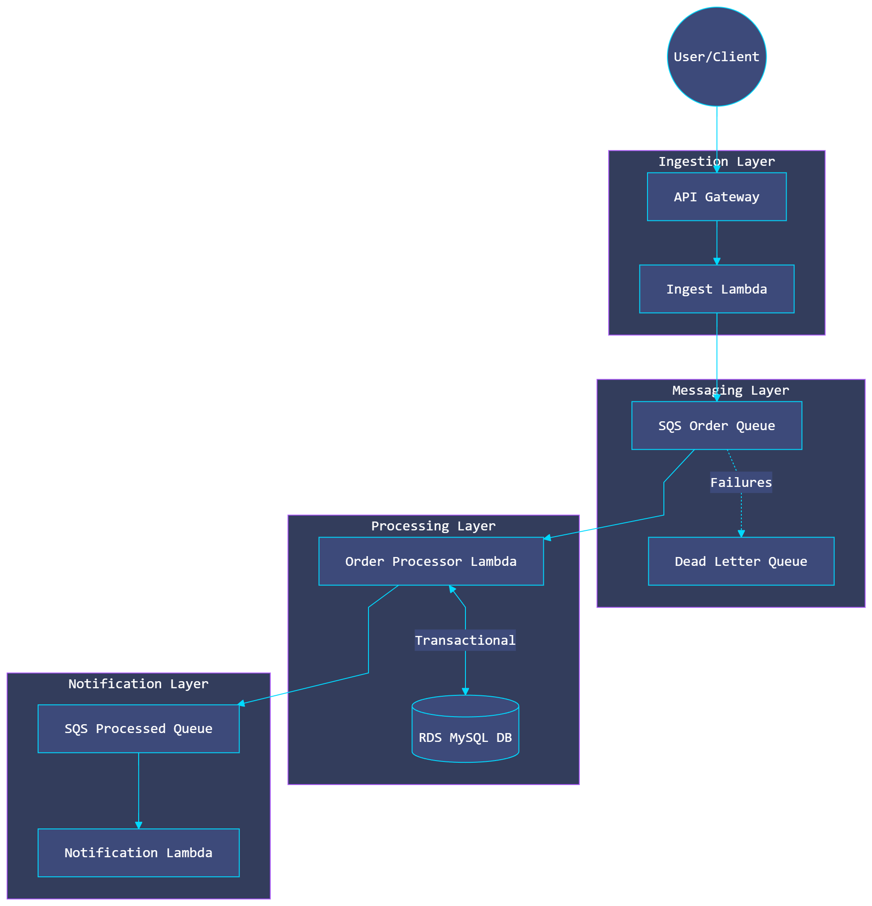
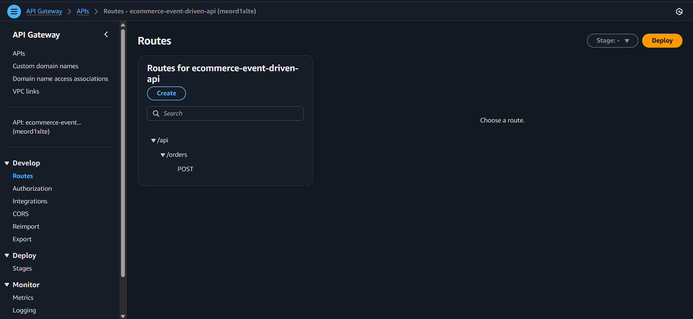
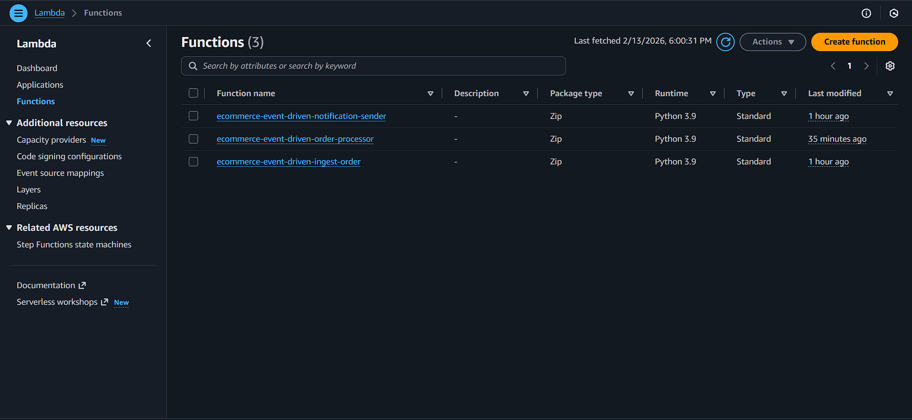
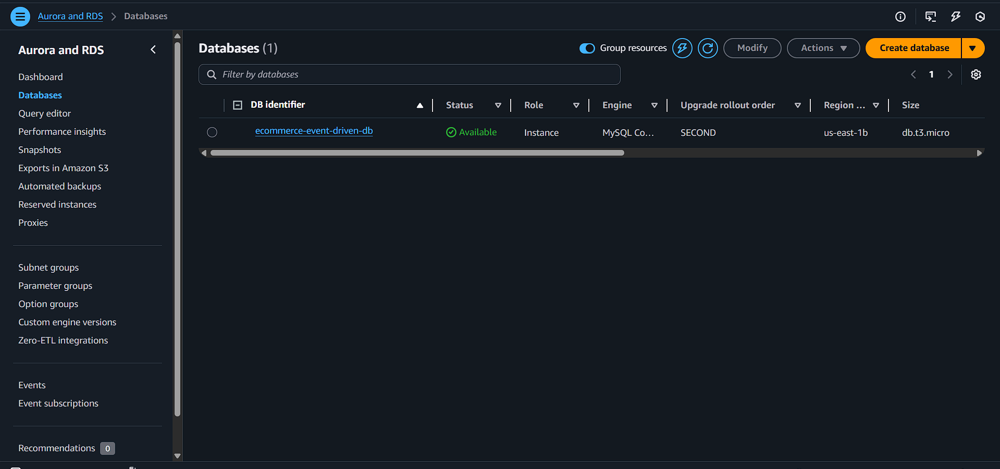
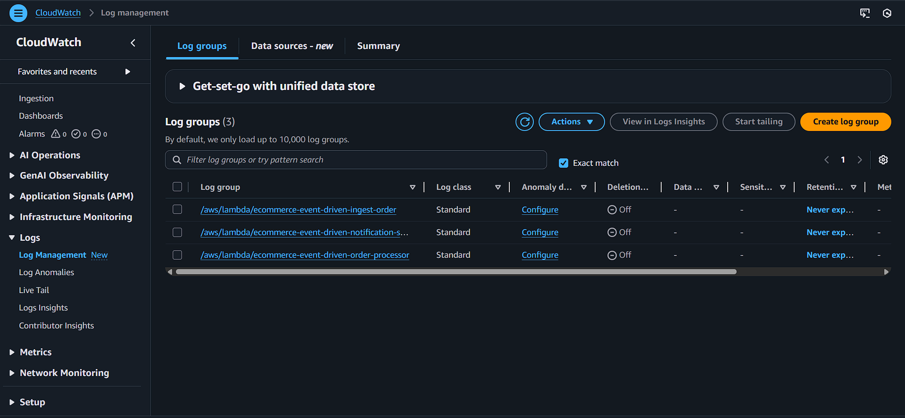

# Event-Driven Serverless E-commerce Order System

A robust, resilient, and highly scalable event-driven architecture built on AWS. This system asynchronously processes e-commerce orders, manages inventory transactionally in a MySQL database, and dispatches downstream notifications using Serverless functions and Message Queues. All infrastructure is provisioned using Terraform (IaC).

## 🏗️ High-Level Architecture



The flow of events is as follows:

1. Client submits an order via **API Gateway**.
2. **Ingest Lambda** validates the payload, generates an idempotent UUID, and publishes an `OrderCreated` event to **SQS (Order Queue)**.
3. **Processor Lambda** consumes the event, strictly locks the inventory row in **RDS (MySQL)** using `FOR UPDATE`, decrements stock, and commits the transaction.
4. Upon success, an `OrderProcessed` event is sent to **SQS (Processed Queue)**.
5. **Notification Lambda** consumes the processed event and simulates a notification dispatch.

*Note: A Dead Letter Queue (DLQ) is attached to the Order Queue for messages failing 3 consecutive times.*

---

## ⚠️ Environment Configuration

### `.env`

Your project requires an `.env` file. Create a file named **`.env`** in your root folder with the following content or refer the `.env.example`:

```env
# Database Configuration
DB_HOST=your-rds-endpoint.amazonaws.com (you will get after terraform apply.)
DB_USER=admin
DB_PASSWORD=your_secure_password (you will get after terraform apply.)
DB_NAME=ecommerce

# AWS Config (For Local Testing)
AWS_DEFAULT_REGION=us-east-1
AWS_ACCESS_KEY_ID=mock_key
AWS_SECRET_ACCESS_KEY=mock_secret

```
---

## 📦 Lambda Dependency Management

To ensure the Order Processor Lambda can connect to the RDS instance, the `pymysql` library must be installed directly into the source directory. This is because AWS Lambda requires all non-standard dependencies to be included in the deployment package.

### How to prepare the dependencies:

If you see the `order_processor` folder without the `pymysql` subdirectories, run the following command from the root of the project:
```bash
pip install pymysql -t src/order_processor/
```

### Why this is necessary:

* **Cloud Execution:** Unlike your local machine, the AWS Lambda environment does not have `pymysql` pre-installed.
* **Terraform Packaging:** Our Terraform configuration (`processor.tf`) zips the entire `src/order_processor` folder. By installing the package with the `-t` (target) flag, we ensure the library is included in that `.zip` file and uploaded to AWS.

### Verification

After running the command, your file structure should match the following:

* `src/order_processor/pymysql/`

---

## 🚀 Deployment Instructions (AWS)

This project uses Terraform to provision the entire architecture.

**Prerequisites:**

- AWS CLI configured with valid credentials (`aws configure`) / give the credentials in the .env file.
- Terraform installed
- Python 3.9+ installed locally

**Python required packages:**
   ```bash
   pip install -r requirements.txt
   ```
It installed the `python-dotenv and boto3`.

**Steps to Deploy:**

1. Navigate to the infrastructure folder:

   ```bash
   cd iac
   ```

2. Initialize Terraform providers:

   ```bash
   terraform init
   ```

3. Deploy the infrastructure (Type `yes` when prompted):

   ```bash
   terraform apply
   ```

   Terraform will output the `api_endpoint`. Use this URL to send POST requests via Postman or CURL  `db_endpoint`  update in the .env file.
   
   For *db_password* use this command : `terraform output -raw db_password` & update it in .env file.

4. **Teardown** (To avoid AWS charges):

   ```bash
   terraform destroy -auto-approve
   ```

---
## 🗄️ Database Initialization

After deploying the infrastructure with Terraform, you must initialize the RDS MySQL database schema and populate it with sample inventory items.

---

### Steps to Initialize

### 1. Configure Credentials

Ensure your `.env` file contains the correct `DB_HOST` (from Terraform output) and `DB_PASSWORD`.
### 2. Run the Script

Execute the following command from the `src/order_processor` directory:

```bash
python init_db.py
```

**What this script does:**

- **Creates Tables:** Generates the `orders` and `inventory` tables using the `db/init_schema.sql` file.
- **Seeds Data:** Inserts 5 sample products into the inventory (e.g., Wireless Headphones, Gaming Mouse).
- **Verifies Connection:** Ensures your local machine can successfully communicate with the AWS RDS instance.


### 3. Verification

To confirm the database is ready, run the check script:

```bash
python check_db.py
```
---
## 📖 API Documentation

### POST /api/orders

Accepts a new order request. Implements strict validation and idempotency (identical payloads return the same order_id to prevent double-charging).

**Request Headers:** `Content-Type: application/json`

**Expected Payload:**

```json
{
  "customer_id": "cust-12345",
  "items": [
    {
      "product_id": "prod-101",
      "quantity": 2
    }
  ]
}
```

**Response Codes:**

- **202 Accepted**: Payload valid, event pushed to SQS successfully.
- **400 Bad Request**: Missing fields, invalid types, or quantity <= 0.
- **500 Internal Server Error**: Cloud provider or downstream failure.

**Success Response (202):**

```json
{
  "message": "Order accepted",
  "order_id": "3b1f16d4-37da-40c2-a24a-92dfc3636d4b"
}
```
---

# 🧪 Testing & Verification Guide

Once the infrastructure is deployed via Terraform and the database is initialized, perform the following tests to verify the system requirements.

---

### 1. Test 1: The "Happy Path" (End-to-End Success)

This verifies that a valid order flows through the entire system: API Gateway → Ingestion Lambda → SQS → Processor Lambda → RDS.

**Command:**

```bash
curl -X POST YOUR_API_ENDPOINT \
-H "Content-Type: application/json" \
-d '{"customer_id": "test_user_001", "items": [{"product_id": "prod-101", "quantity": 1}]}'
```

**Verification:**

- **API Response:** You should receive a `202 Accepted` status with a unique `order_id`.
- **Database:** Run `python check_db.py`. The order status should be `PROCESSED`, and the inventory for `prod-101` should have decreased by 1.

---

### 2. Test 2: Idempotency (Duplicate Protection)

This verifies Requirement #14: the system must handle duplicate requests gracefully without double-deducting inventory.

**Action:** Run the exact same `curl` command used in Test 1.

**Verification:**

- **API Response:** You must receive the exact same `order_id` as the previous request.
- **Database:** Run `python check_db.py`. The inventory for `prod-101` must not decrease again. The system correctly ignored the duplicate processing.

---

### 3. Test 3: Validation (Bad Request)

This verifies Requirement #1 & #2: strict input validation.

**Command:**

```bash
curl -X POST YOUR_API_ENDPOINT \
-H "Content-Type: application/json" \
-d '{"customer_id": "hacker_002", "items": [{"product_id": "prod-102", "quantity": -5}]}'
```

**Verification:**

- **API Response:** The terminal should return a `400 Bad Request`.
- **System Integrity:** Because validation happens at the Ingestion Lambda, no message is sent to SQS, and the database remains untouched.

---

### 4. Test 4: Insufficient Inventory (Transaction Rollback)

This verifies Requirement #12: transactional integrity and error state handling.

**Action:** Request a quantity higher than the available stock (e.g., 9,999 items).

```bash
curl -X POST YOUR_API_ENDPOINT \
-H "Content-Type: application/json" \
-d '{"customer_id": "greedy_user_003", "items": [{"product_id": "prod-102", "quantity": 9999}]}'
```

**Verification:**

- **API Response:** Returns `202 Accepted` (as the payload is valid).
- **Database:** After processing, `python check_db.py` should show the order status as `FAILED`.
- **Inventory:** The stock for `prod-102` remains unchanged, proving the database transaction successfully rolled back.
---

## 📦 Event Schemas

### 1. OrderCreated Event (Pushed to SQS Order Queue)

```json
{
  "order_id": "3b1f16d4-37da-40c2-a24a-92dfc3636d4b",
  "customer_id": "cust-12345",
  "items": [
    {
      "product_id": "prod-101",
      "quantity": 2
    }
  ],
  "timestamp": "2026-02-13T10:00:00.000Z"
}
```

### 2. OrderProcessed Event (Pushed to SQS Processed Queue)

```json
{
  "order_id": "3b1f16d4-37da-40c2-a24a-92dfc3636d4b",
  "customer_id": "cust-12345",
  "status": "PROCESSED",
  "processed_at": "2026-02-13T10:00:05.000Z"
}
```

---


## 🧪 Local Testing & Verification

We use Docker to orchestrate a local MySQL database and run automated unit tests, ensuring over 70% code coverage of core business logic without needing live AWS credentials.

1. Ensure Docker Desktop is running.

2. From the root directory, build and run the test container:

   ```bash
   docker-compose up --build tests
   ```

The output will display the pytest results, verifying successful processing, transactional rollbacks, and simulated SQS message dispatches.

---

## 📸 Cloud Console Screenshots


- **API Gateway Endpoint Config:** 

- **SQS Queues & DLQ:**

- **Lambda Functions (Processor/Notification):** 

- **Database:**

- **CloudWatch Logs (Showing Success & Rollbacks):** 


---


```
